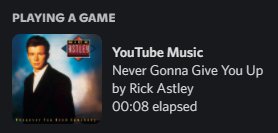

# Discord RPC for YouTube Music 

I was always jealous of my friends who used Spotify because they could show off their impeccable taste in music for the world to see on Discord, while I was forced to enjoy my music all alone.

*Until now!*

# Installing

* Add the [userscript](https://github.com/adrian154/discord-yt-music-rpc/blob/main/userscript.js) via [TamperMonkey](https://www.tampermonkey.net/) 
* Download the [app](https://github.com/adrian154/discord-yt-music-rpc/releases/tag/0.0.1) and run it.
* Listen to some tunes!

# How It Works

The userscript watches YouTube music for updates via the [Media Session API](https://developer.mozilla.org/en-US/docs/Web/API/Media_Session_API) and relays them to the local app by making an HTTP request to a webserver running on `localhost:19347`. When the app receives an update, it updates your Discord activity.

# Should you use this?

No. Go use [PreMid](https://premid.app/), it's better. I don't really know why I bothered making this.